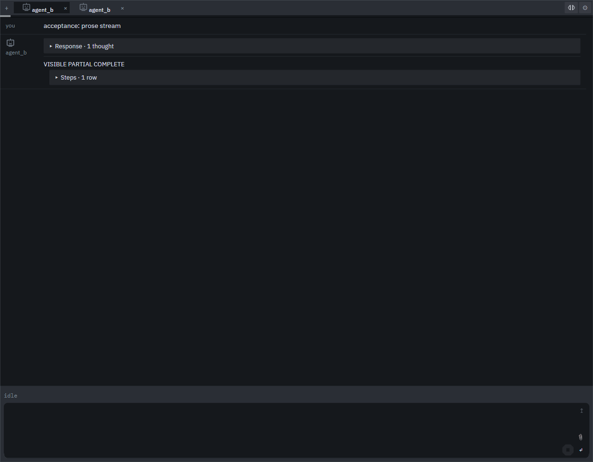

# Agent_b

Agent_b is a Windows-first coding agent for OpenAI-compatible models. It is one Go process with a dependency-free browser UI, durable chats and plans, governed tools, context accounting, and an optional low-privilege service identity.



## Install and first run

1. Download the signed [Agent_b-setup.exe](https://github.com/rkclayton/agent_b/releases/latest/download/Agent_b-setup.exe) and double-click it. The normal per-user install needs no UAC prompt or console window.
2. Open Agent_b from Start. Setup can connect an existing OpenAI-compatible endpoint, install a pinned local llama.cpp model, or defer model setup.
3. To use the Windows service-account boundary, approve **Set up service identity** once in Settings → Security. Until that succeeds, executing and mutating tools remain unavailable; you may instead disable the split deliberately.

The installed app is a singleton. Its own WebView2 window falls back to an Edge app window when the runtime or loader is unavailable. Reopening the shortcut focuses the healthy instance.

## Use it

- **Chat** holds durable conversations and delivered-file links. Start a chat, name the repository or plan, and describe the work.
- **Plan** shows accepted work and can run its next verified item with **Go**. Planning proposes edits; the operator accepts them.
- **Console** shows live activity, context use, tool calls, and retained agent statistics.
- **Settings** owns Agents, Activity, Connections, Profiles, Chats, Notifications, Security, and About.

Files created by a run appear as download chips and, by default, are also copied to `%USERPROFILE%\Agent_b`. The paperclip accepts local files or files from that folder. Operator state, chats, plans, memory, and logs live under `%LocalAppData%\Agent_b`; the normal application lives under `%LocalAppData%\Programs\Agent_b`.

Agent_b checks for updates and reports them in About. Selecting **Update** downloads and verifies the signed installer before launching it; it never installs silently. Uninstall preserves operator data unless purge is explicitly selected.

## Source development

Go 1.24+ is required. `start-Agent_b.cmd` builds and runs a checkout. A compatible endpoint is enough; llama.cpp additionally enables exact template/token accounting when it exposes `/tokenize` and `/apply-template`.

```text
go test ./...
node tests/run-node-tests.mjs
npm ci
npm run test:ui
```

Node and Playwright are test-only dependencies. See the [operator reference](docs/REFERENCE.md), [hardening runbook](docs/HARDENING.md), [security model](SECURITY.md), [runtime contracts](INTERFACES.md), and [test gates](tests/README.md).

Apache-2.0. See [NOTICE](NOTICE) and [third-party notices](docs/THIRD_PARTY_NOTICES.md).
