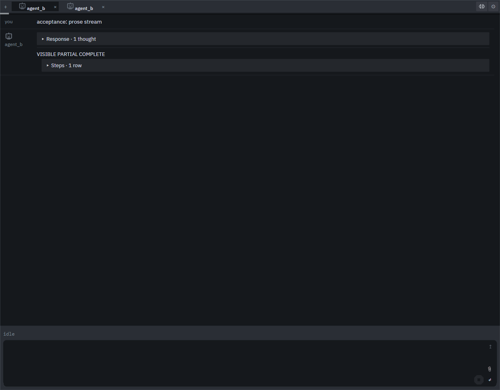

# Agent_b

Agent_b is a Windows-first coding agent for OpenAI-compatible models. It is one Go process with a dependency-free browser UI, durable chats and plans, governed tools, context accounting, and an optional low-privilege service identity.



## Install and first run

1. Download the signed [Agent_b-setup.exe](https://github.com/rkclayton/agent_b/releases/latest/download/Agent_b-setup.exe) and double-click it. The normal per-user install needs no UAC prompt or console window.
2. Open Agent_b from Start. Setup can connect an existing OpenAI-compatible endpoint, install a pinned local llama.cpp model, or defer model setup.
3. To use the Windows service-account boundary, approve **Set up service identity** once in Settings → Security. Until that succeeds, executing and mutating tools remain unavailable; you may instead disable the split deliberately.

The installed app is a singleton. Its own WebView2 window falls back to an Edge app window when the runtime or loader is unavailable. Reopening the shortcut focuses the healthy instance.

## Everything else

[Operator reference](docs/REFERENCE.md) — the surfaces, the tools, configuration, updates, and where your data lives.

[Where the work lives](docs/REPOSITORIES.md) — the four repositories, what each owns, and what the VPS is for.

## From a prompt

`agentb` runs one task in the current directory without the app:

    agentb "add a unit test for the parser and run it"

It is the same engine, the same configuration, connections and credentials, and
the same tools and jail — approvals are terminal prompts with the app's scopes.
`--json` emits the event stream for scripts, `--unattended` means nothing asks
and a boundary hit fails the run, and the run is journaled to the folder's
`.agentb/` in the same format the app reads.

It is installed beside the app and signed with it. **The installer does not put
it on your PATH** — a deliberate decision, not an oversight: editing shared,
length-limited machine state on every deployment pass is a well-known way to
break a working machine. Run it by its path, or add the directory once —
[the reference](docs/REFERENCE.md#the-command-line-agent) has the one-liner for
each install mode.

    %LOCALAPPDATA%\Programs\Agent_b\agentb.exe        per-user install
    %ProgramFiles%\Agent_b\agentb.exe                 all-users install

## Source development

Go 1.24+ is required. `start-Agent_b.cmd` builds and runs a checkout. A compatible endpoint is enough; llama.cpp additionally enables exact template/token accounting when it exposes `/tokenize` and `/apply-template`.

```text
go test ./...
node tests/run-node-tests.mjs
npm ci
npm run test:ui
```

Node and Playwright are test-only dependencies. See the [operator reference](docs/REFERENCE.md), [hardening runbook](docs/HARDENING.md), [security model](SECURITY.md), [runtime contracts](INTERFACES.md), and [test gates](tests/README.md).

Apache-2.0. See [NOTICE](NOTICE) and [third-party notices](docs/THIRD_PARTY_NOTICES.md).
